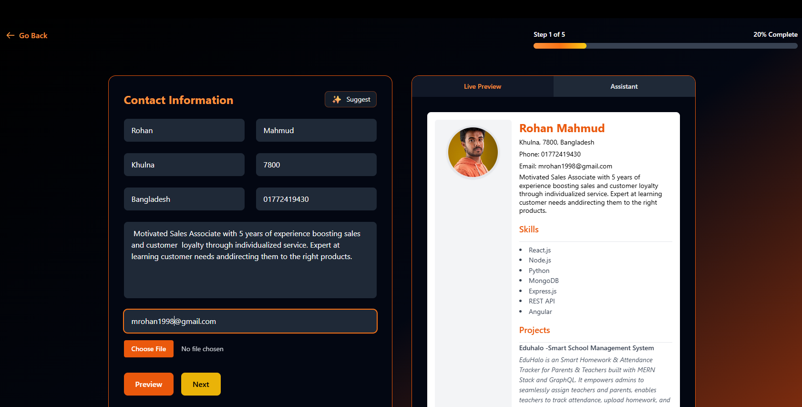
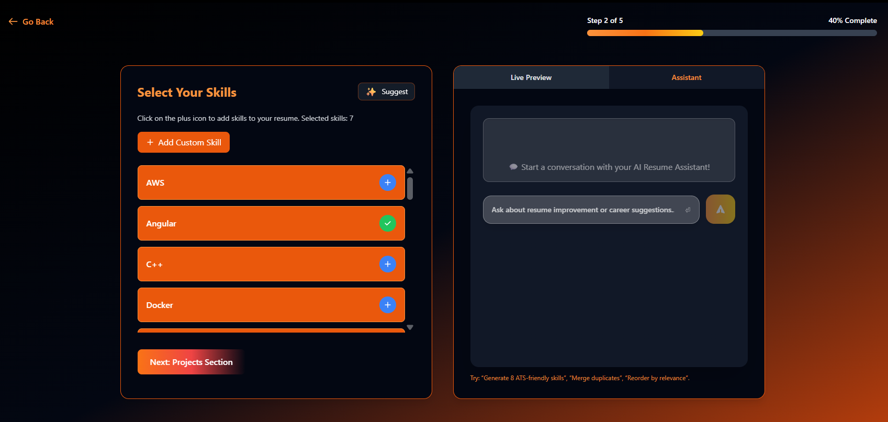

# 💼 SkillSync – Ai Powered Customizable Resume Builder

<p align="center">
  
</p>

---

## ✨ What is SkillSync?

**SkillSync** is a cutting-edge resume builder web application designed to help job seekers create professional, ATS-optimized resumes effortlessly. With its intuitive interface and real-time preview, users can craft compelling resumes that stand out to both hiring managers and applicant tracking systems.

### 🎯 Why Choose SkillSync?
-  **Lightning Fast** - Built with modern web technologies for optimal performance  
-  **Beautiful Templates** - Multiple professionally designed layouts  
-  **Fully Responsive** - Works seamlessly on all devices  
-  **ATS-Friendly** - Optimized for applicant tracking systems  
-  **Real-time Preview** - See changes instantly as you type  

---

## 🛠️ Tech Stack

<p align="center">
  
  
  
  
  
</p>

---

## ⚙️ Installation

1. **Clone the repository**
   ```bash
   git clone https://github.com/symadev/skillsync.git
   ```

2. **Navigate to the project directory**
   ```bash
   cd skillsync
   ```

3. **Install dependencies**
   ```bash
   npm install
   ```
   or
   ```bash
   yarn install
   ```

4. **Start development server**
   ```bash
   npm run dev
   ```
   or
   ```bash
   yarn dev
   ```

5. **Open your browser**
   ```
   http://localhost:5173
   ```

---

<p align="center">
  
  
</p>

---

## 🎯 How to Use

### Step 1: 🏠 **Get Started**
Open the application in your browser and begin with the welcome screen.

### Step 2: 📝 **Fill Your Information**
Use the intuitive form interface to add your:
- Personal information and contact details
- Work experience and achievements
- Education background
- Skills and competencies
- Projects 

### Step 3: 🎨 **Customize Your Design**
- Choose from multiple professional color themes
- Select your preferred layout style
- Watch real-time updates in the preview panel

### Step 4: 📤 **Export & Use**
- Review your resume in the live preview
- Export or print with a clean, professional layout
- Share your ATS-optimized resume with confidence

---

## 🤝 Contributing

We welcome contributions from the community! Here's how you can help make SkillSync even better:

### 🔧 Development Setup

1. **Fork the repository**
   ```bash
   git fork https://github.com/symadev/skillsync.git
   ```

2. **Create a feature branch**
   ```bash
   git checkout -b feature/amazing-feature
   ```

3. **Make your changes**
   - Write clean, documented code
   - Follow existing code style
   - Test your changes thoroughly

4. **Commit your changes**
   ```bash
   git commit -m "✨ Add amazing feature"
   ```

5. **Push to your fork**
   ```bash
   git push origin feature/amazing-feature
   ```

6. **Open a Pull Request**
   - Provide a clear description of changes
   - Include screenshots if applicable
   - Reference any related issues

### 🐛 Found a Bug?
- Check existing issues first
- Create a detailed bug report
- Include steps to reproduce

---

## 🌟 Show Your Support

If you find SkillSync helpful, please consider:
- ⭐ Starring the repository
- 🍴 Forking the project
- 📢 Sharing with friends and colleagues
- 💬 Providing feedback and suggestions

---

## 📄 License

This project is licensed under the MIT License – see the [LICENSE](LICENSE) file for details.

---

## 👥 Authors

- **@symadev** – *Initial work* – [GitHub Profile](https://github.com/symadev)
